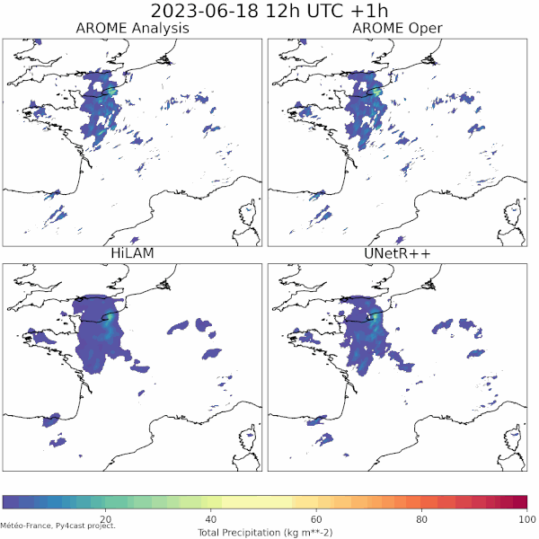

# PY4CAST


This project, built using **PyTorch** and **PyTorch-lightning**, is designed to train a variety of Neural Network architectures (GNNs, CNNs, Vision Transformers, ...) on various weather forecasting datasets. This is a **Work in Progress**, intended to share ideas and design concepts with partners.

Developped at Météo-France by **DSM/AI Lab** and **CNRM/GMAP/PREV**.

Contributions are welcome (Issues, Pull Requests, ...).

This project is licensed under the [APACHE 2.0 license.](LICENSE-2.0.txt)




# Acknowledgements

This project started as a fork of neural-lam, a project by Joel Oskarsson, see [here](https://github.com/mllam/neural-lam). Many thanks to Joel for his work!


# Table of contents

0. [Overview](#overview)
1. [Features](doc/features.md)
    1. [Neural network architectures](doc/features.md#available-pytorchs-architectures)
    2. [Datasets](doc/features.md#available-datasets)
    3. [Losses](doc/features.md#available-losses)
    4. [Plots](doc/features.md#available-plots)
    5. [Training strategies](doc/features.md#available-training-strategies)
    6. [NamedTensors](doc/features.md#namedtensors)
2. [Installation](#installation)
3. [Usage](#usage)
    1. [Docker and runai (MF)](#docker-and-runai)
    2. [Conda or Micromamba](#conda-or-micromamba)
    3. [Specifying your sbatch card](#specifying-your-sbatch-card)
    4. [Dataset configuration & simple training](#dataset-configuration--simple-training)
    5. [Training options](#training-options)
    6. [Experiment tracking](#tracking-experiment)
    7. [Inference](#inference)
    8. [Making animated plots comparing multiple models](#making-animated-plots-comparing-multiple-models)
4. [Contributing new features](#adding-features-and-contributing)
    1. [Adding a neural network architecture](doc/add_features_contribute.md#adding-a-new-neural-network-architecture-to-the-project)
    2. [Adding a dataset](doc/add_features_contribute.md#adding-a-new-dataset)
    3. [Adding plots](doc/add_features_contribute.md#adding-training-plots)
5. [Design choices](#design-choices)
6. [Unit tests](doc/add_features_contribute.md#unit-tests)
7. [Continuous Integration](doc/add_features_contribute.md#continuous-integration)


## Overview

* Use any neural network architectures available in [mfai](https://github.com/meteofrance/mfai?tab=readme-ov-file#neural-network-architectures)
* 1 dataset with samples available on Huggingface : Titan
* 3 training strategies : Scaled Auto-regressive steps, Differential Auto-regressive steps, Downscaling strategy
* 4 losses: Scaled RMSE, Scaled L1, Weighted MSE, Weighted L1
* neural networks as simple torch.nn.Module
* training with pytorchlightning
* simple interfaces to easily add a new dataset, neural network, training strategy or loss
* simple command line to lauch a training
* config files to change the parameters of your dataset or neural network during training
* experiment tracking with tensorboard and plots of forecasts with matplotlib
* implementation of [NamedTensors](doc/features.md#namedtensors) to tracks features and dimensions of tensors at each step of the training

See [here](doc/features.md) for details on the available datasets, neural networks, training strategies, losses, and explanation of our NamedTensor.

## Installation

Start by cloning the repository:
```bash
git clone https://github.com/meteofrance/py4cast.git
cd py4cast
```

### Setting environment variables

In order to be able to run the code on different machines, some environment variables can be set.
You may add them in your `.bashrc` or modify them just before launching an experiment.

- `PY4CAST_ROOTDIR` : Specify the ROOT DIR for your experiment. It also modifies the CACHE_DIR. This is where the files created during the experiment will be stored.
- `PY4CAST_SMEAGOL_PATH`: Specify where the smeagol dataset is stored. Only needed if you want to use the smeagol dataset.
- `PY4CAST_TITAN_PATH`: Specify where the titan dataset is stored. Only needed if you want to use the titan dataset.

This should be done by
```sh
export PY4CAST_ROOTDIR="/my/dir/"
```

You **MUST** export **PY4CAST_ROOTDIR** to make py4cast work, you can use for instance the existing **SCRATCH** env var:
```bash
export PY4CAST_ROOTDIR=$SCRATCH/py4cast
```

If **PY4CAST_ROOTDIR** is not exported py4cast will default to use **/scratch/shared/py4cast** as its root directory, leading to Exceptions if this directory does not exist or if it is not writable.

### At Météo-France

When working at Météo-France, you can use either runai + Docker or Conda/Micromamba to setup a working environment. On the AI Lab cluster we recommend using runai, Conda on our HPC.

See the [runai repository](https://git.meteo.fr/dsm-labia/monorepo4ai) for installation instructions.

For HPC, see the related doc (doc/install/install_MF.md) to get the right installation settings.

### Install with conda

You can install a conda environment, including `py4cast` in editable mode, using
```sh
conda env create --file env.yaml
```

From an exixting conda environment, you can now install manually `py4cast` in development mode using
```sh
conda install conda-build -n py4cast
conda develop .
```
or
```sh
pip install --editable .
```

In case the install fail because some dependencies are not found or are in conflict, please look at the [installation known issues](doc/known_issues.md#installation).


### Install with micromamba

Please install the environment using :
```sh
micromamba create -f env.yaml
```

From an exixting micromamba environment, you can now install manually `py4cast` in editable mode using
```sh
pip install --editable .
```

### Build docker image

To build the docker image please use the `oci-image-build.sh` script.
For Meteo-France user, you should export the variable `INJECT_MF_CERT` to use the Meteo-France certificate
```sh
export INJECT_MF_CERT=1
```
Then, build with the following command 
```sh
bash ./oci-image-build.sh --runtime docker
```
By default, the `CUDA` and `pytorch` version are extracted from the `env.yaml` reference file. Nevertheless, for test purpose, you can set the **PY4CAST_CUDA_VERSION** and **PY4CAST_TORCH_VERSION** to override the default versions.

### Build podman image

As an alternative to docker, you can use podman to build the image.

<details>
<summary>Click to expand</summary>

To build the podman image please use the `oci-image-build.sh` script.
```sh
bash ./oci-image-build.sh --runtime podman
```
By default, the `CUDA` and `pytorch` version are extracted from the `env.yaml` reference file. Nevertheless, for test purpose, you can set the **PY4CAST_CUDA_VERSION** and **PY4CAST_TORCH_VERSION** to override the default versions.

</details>

### Convert to Singularity image

From a previously built docker or podman image, you can convert it to the singularity format.

<details>
<summary>Click to expand</summary>

To convert the previously built image to a Singularity container, you have to first save the image as a `tar` file:
```sh
docker save py4cast:your_tag -o py4cast-your_tag.tar
```
or with podman:
```sh
podman save --format oci-archive py4cast:your_tag -o py4cast-your_tag.tar
```

Then, build the singularity image with:
```sh
singularity build py4cast-your_tag.sif docker-archive://py4cast-your_tag.tar
```
Please, be sure to get enough free disk space to store the .tar and .sif files.

</details>

## Usage

### Docker

From your `py4cast` source directory, to run an experiment using the docker image you need to mount in the container :
- The dataset path
- The py4cast sources
- The PY4CAST_ROOTDIR path

Here is an example of command to run a "dev_mode" training of the HiLam model with the TITAN dataset, using all the GPUs:
```sh
docker run \
    --name hilam-titan \
    --rm \
    --gpus all \
    -v ./${HOME} \
    -v <path-to-datasets>/TITAN:/dataset/TITAN \
    -v <your_py4cast_root_dir>:<your_py4cast_root_dir> \
    -e PY4CAST_ROOTDIR=<your_py4cast_root_dir> \
    -e PY4CAST_TITAN_PATH=/dataset/TITAN \
    py4cast:<your_tag> \
    bash -c " \
        pip install -e . &&  \
        python bin/main.py predict\
            --config config/CLI/trainer.yaml \
            --config config/CLI/model/hilam.yaml \
            --config config/CLI/dataset/titan.yaml \
            --dev_mode \
    "
```

### Podman

<details>
<summary>Click to expand</summary>

From your `py4cast` source directory, to run an experiment using the podman image you need to mount in the container :
- The dataset path
- The py4cast sources
- The PY4CAST_ROOTDIR path

Here is an example of command to run a "dev_mode" training of the HiLam model with the TITAN dataset, using all the GPUs:
```sh
podman run \
    --name hilam-titan \
    --rm \
    --device nvidia.com/gpu=all \
    --ipc=host \
    --network=host \
    -v ./${HOME} \
    -v <path-to-datasets>/TITAN:/dataset/TITAN \
    -v <your_py4cast_root_dir>:<your_py4cast_root_dir> \
    -e PY4CAST_ROOTDIR=<your_py4cast_root_dir> \
    -e PY4CAST_TITAN_PATH=/dataset/TITAN \
    py4cast:<your_tag> \
    bash -c " \
        pip install -e . &&  \
        python bin/main.py fit\
            --config config/CLI/trainer.yaml \
            --config config/CLI/model/hilam.yaml \
            --config config/CLI/dataset/titan.yaml \
            --dev_mode \
    "
```
</details>

### Singularity

<details>
<summary>Click to expand</summary>

From your `py4cast` source directory, to run an experiment using a singularity container you need to mount in the container :
- The dataset path
- The PY4CAST_ROOTDIR path

Here is an example of command to run a "dev_mode" training of the HiLam model with the TITAN dataset:
```sh
PY4CAST_TITAN_PATH=/dataset/TITAN \
PY4CAST_ROOTDIR=<your_py4cast_root_dir> \
singularity exec \
    --nv \
    --bind <path-to-datasets>/TITAN:/dataset/TITAN \
    --bind <your_py4cast_root_dir>:<your_py4cast_root_dir> \
    py4cast-<your_tag>.sif \
    bash -c " \
        pip install -e . &&  \
        python bin/main.py fit\
            --config config/CLI/trainer.yaml \
            --config config/CLI/model/hilam.yaml \
            --config config/CLI/dataset/titan.yaml \
            --dev_mode \
    "
```
</details>

### runai

For now this works only for internal Météo-France users.

<details>
<summary>Click to expand</summary>

`runai` commands must be issued at the root directory of the `py4cast` project:

1. Run an interactive training session

```bash
runai gpu_play 4
runai build
runai exec_gpu python bin/main.py fit --config config/CLI/trainer.yaml --config config/CLI/dataset/titan.yaml --config config/CLI/model/hilam.yaml
```

2. Train using sbatch single node multi-GPUs

```bash
export RUNAI_GRES="gpu:v100:4"
runai sbatch python bin/main.py fit --config config/CLI/trainer.yaml --config config/CLI/dataset/titan.yaml --config config/CLI/model/hilam.yaml
```

3. Train using sbatch multi nodes multi GPUs

Here we use 2 nodes with 4 GPUs each.

```bash
export RUNAI_SLURM_NNODES=2
export RUNAI_GRES="gpu:v100:4"
runai sbatch_multi_node python bin/main.py fit --config config/CLI/trainer.yaml --config config/CLI/dataset/titan.yaml --config config/CLI/model/hilam.yaml
```

For the rest of the documentation, you must preprend each python command with `runai exec_gpu`.
</details>


### Conda or Micromamba

Once your micromamba environment is setup, you should :
 - activate your environment `conda activate py4cast` or `micromamba activate nlam`
 - launch a training

A very simple training can be launch (on your current node)
```sh
python bin/main.py fit --config config/CLI/trainer.yaml --config config/CLI/dataset/dummy.yaml --config config/CLI/model/hilam.yaml
```

#### Example of script  to launch on gpu

To do so, you will need to create a small `sh` script.

```sh
#!/usr/bin/bash
#SBATCH --partition=ndl
#SBATCH --nodes=1 # Specify the number of GPU node you required
#SBATCH --gres=gpu:1 # Specify the number of GPU required per Node
#SBATCH --time=05:00:00 # Specify your experiment Time limit
#SBATCH --ntasks-per-node=1 # Specify the number of task per node. This should match the number of GPU Required per Node

# Note that other variable could be set (according to your machine). For example you may need to set the number of CPU or the memory used by your experiment.
# On MF hpc, this is proportional to the number of GPU required per node. This is not the case on other machine (e.g MétéoFrance AILab machine).

source ~/.bashrc  # Be sure that all your environment variables are set
conda activate py4cast # Activate your environment (installed by micromamba or conda)
cd $PY4CAST_PATH # Go to Py4CAST (you can either add an environment variable or hard code it here).
# Launch your favorite command.
srun bin/main.py fit --config config/CLI/trainer.yaml --config config/CLI/dataset/dummy.yaml --config config/CLI/model/hilam.yaml
```


Then just launch this script using

```sh
sbatch my_tiny_script.sh
```
**NB** Note that you may have some trouble with SSL certificates (for cartopy). You may need to explicitely export the certificate as :
```sh
 export SSL_CERT_FILE="/opt/softs/certificats/proxy1.pem"
```
with the proxy path depending on your machine.

### Dataset configuration & simple training

As in neural-lam, before training you must first compute the mean and std of each feature.

To compute the stats of the Titan dataset:

```bash
python py4cast/datasets/titan/__init__.py
```

To train on a dataset with its default settings just pass the name of the dataset (all lowercase) :

```bash
python bin/main.py fit --config config/CLI/trainer.yaml --config config/CLI/dataset/titan.yaml --config config/CLI/model/hilam.yaml
```

You can override the dataset default configuration file:

```bash
python bin/main.py fit --config config/CLI/trainer.yaml --config config/CLI/dataset/titan.yaml --config config/CLI/model/hilam.yaml --data.dataset_conf config/smeagoldev.json
```

[Details on available datasets.](doc/features.md/#available-datasets)

### Training options

1. **Configuring the neural network**

To train on a dataset using a network with its default settings just pass the name of the architecture (all lowercase) as shown below:

```bash
python bin/main.py fit --config config/CLI/trainer.yaml --config config/CLI/dataset/smeagol.yaml --config config/CLI/model/hilam.yaml

python bin/main.py fit --config config/CLI/trainer.yaml --config config/CLI/dataset/smeagol.yaml --config config/CLI/model/halfunet.yaml
```

You can override some settings of the model using a json config file (here we increase the number of filter to 128 and use ghost modules):

```bash
python bin/train.py --dataset smeagol --model HalfUNet --model_conf config/halfunet128_ghost.json
```

[Details on available neural networks.](doc/features.md/#available-pytorchs-architecture)


2. **Changing the training strategy**

You can choose a training strategy using the **--strategy STRATEGY_NAME** cli argument:

```bash
python bin/train.py --dataset smeagol --model HalfUNet --strategy diff_ar
```

[Details on available training strategies.](doc/features.md/#available-training-strategies)


3. **Other training options**:

* `--seed SEED`           random seed (default: 42)
* `--loss LOSS`           Loss function to use (default: mse)
* `--lr LR`               learning rate (default: 0.001)
* `--val_interval VAL_INTERVAL`
                    Number of epochs training between each validation run (default: 1)
* `--epochs EPOCHS`       upper epoch limit (default: 200)
* `--profiler PROFILER`   Profiler required. Possibilities are ['simple', 'pytorch', 'None']
* `--batch_size BATCH_SIZE`
                    batch size
* `--precision PRECISION`
                    Numerical precision to use for model (32/16/bf16) (default: 32)
* `--limit_train_batches LIMIT_TRAIN_BATCHES`
                    Number of batches to use for training
* `--num_pred_steps_train NUM_PRED_STEPS_TRAIN`
                    Number of auto-regressive steps/prediction steps during training forward pass
* `--num_pred_steps_val_test NUM_PRED_STEPS_VAL_TEST`
                    Number of auto-regressive steps/prediction steps during validation and tests
* `--num_input_steps NUM_INPUT_STEPS`
                    Number of previous timesteps supplied as inputs to the model
* `--num_inter_steps NUM_INTER_STEPS`
                    Number of model steps between two samples
* `--no_log`
    When activated, logs are not stored and models are not saved. Use in dev mode. (default: False)
* `--mlflow_log`
    When activated, the MLFlowLogger is used and the model is saved in the MLFlow style (default: False)
* `--dev_mode`
    When activated, reduce number of epoch and steps. (default: False)
* `--load_model_ckpt LOAD_MODEL_CKPT`
    Path to load model parameters from (default: None)


You can find more details about all the `num_X_steps` options [here](doc/num_steps.md).


### Tracking experiment

#### Tensorboard

We use [Tensorboad](https://www.tensorflow.org/tensorboard) to track the experiments. You can launch a tensorboard server using the following command:

**At Météo-France**:

**runai** will handle port forwarding for you.

```bash
runai tensorboard --logdir PATH_TO_YOUR_ROOT_PATH
```

**Elsewhere**

```bash
tensorboard --logdir PATH_TO_YOUR_ROOT_PATH
```

Then you can access the tensorboard server at the following address: `http://YOUR_SERVER_IP:YOUR_PORT/`


#### MLFlow

Optionally, you can use MLFlow, in addition to Tensorboard, to track your experiment and log your model. To activate the MLFlow logger simply add the `--mlflow_log` option on the `bin/train.py` command line.

**Local usage**

Without a MLFlow server, the logs are stored in your root path, at `PY4CAST_ROOTDIR/logs/mlflow`.

**With a MLFlow server**

If you have a MLFow server you can configure your training environment to push the logs on the remote server. A set of [environment variables](https://mlflow.org/docs/latest/cli.html#mlflow-server) are available to do that.

For exemple, you can export the following variable in your training environment:

```bash
export MLFLOW_TRACKING_URI=https://my.mlflow.server.com/
export MLFLOW_TRACKING_USERNAME=<your-mlflow-user>
export MLFLOW_TRACKING_PASSWORD=<your-mlflow-pwd>
export MLFLOW_EXPERIMENT_NAME=py4cast/unetrpp
```

### Inference

Inference is done by running the `bin/inference.py` script. This script will load a model and run it on a dataset using the training parameters (dataset config, timestep options, ...).

```bash
usage: python bin/inference.py [-h] [--model_path MODEL_PATH] [--dataset DATASET] [--infer_steps INFER_STEPS] [--date DATE]

options:
  -h, --help            show this help message and exit
  --model_path MODEL_PATH
                        Path to the model checkpoint
  --date DATE
                        Date of the sample to infer on. Format:YYYYMMDDHH
  --dataset DATASET
                        Name of the dataset to use (typically the same as has been used for training)
  --dataset_conf DATASET_CONF
                        Name of the dataset config file (json, to change e.g dates, leadtimes, etc)
  --infer_steps INFER_STEPS
                        Number of auto-regressive steps/prediction steps during the inference
   --precision PRECISION
                        floating point precision for the inference (default: 32)
   --grib BOOL
                        Whether the outputs should be saved as grib, needs saving conf.
   --saving_conf SAVING_CONF
                        Name of the config file for write settings (json)
```

A simple example of inference is shown below:

```bash
 runai exec_gpu python bin/inference.py --model_path /scratch/shared/py4cast/logs/camp0/poesy/halfunet/sezn_run_dev_12 --date 2021061621 --dataset poesy_infer --infer_steps 2
```

### Making animated plots comparing multiple models

You can compare multiple trained models on specific case studies and visualize the forecasts on animated plots with the `bin/gif_comparison.py`. See example of GIF at the beginning of the README.

Warnings:
- For now this script only works with models trained with Titan dataset.
- If you want to use AROME as a model, you have to manually download the forecast before.

```bash
Usage: gif_comparison.py [-h] --ckpt CKPT --date DATE [--num_pred_steps NUM_PRED_STEPS]

options:
  -h, --help            show this help message and exit
  --ckpt CKPT           Paths to the model checkpoint or AROME
  --date DATE           Date for inference. Format YYYYMMDDHH.
  --num_pred_steps NUM_PRED_STEPS
                        Number of auto-regressive steps/prediction steps.

example: python bin/gif_comparison.py --ckpt AROME --ckpt /.../logs/my_run/epoch=247.ckpt
                                      --date 2023061812 --num_pred_steps 10
```

### Scoring and comparing models

The `bin/test.py` script will compute and save metrics on the validation set, on as many auto-regressive prediction steps as you want.

```bash
python bin/test.py PATH_TO_CHECKPOINT --num_pred_steps 24
```

Once you have executed the `test.py` script on all the models you want, you can compare them with `bin/scores_comparison.py`:

```bash
python bin/scores_comparison.py --ckpt PATH_TO_CKPT_0  --ckpt PATH_TO_CKPT_1
```

**Warning**: For now `bin/scores_comparison.py` only works with models trained with Titan dataset

## Adding features and contributing

This [page](doc/add_features_contribute.md) explains how to:
* add a new neural network
* add a new dataset
* contribute to this project following our guidelines

## Design choices

The figure below illustrates the principal components of the Py4cast architecture.


- We define **interface contracts** between the components of the system using [Python ABCs](https://docs.python.org/3/library/abc.html). As long as the Python classes respect the interface contract, they can be used interchangeably in the system and the underlying implementation can be very different. For instance datasets with any underlying storage (grib2, netcdf, mmap+numpy, ...) and real-time or ahead of time concat and pre-processing could be used with the same neural network architectures and training strategies.

- **Adding a model, a dataset, a loss, a plot, a training strategy, ... should be as simple as creating a new Python class that complies with the interface contract**.

- Dataset produce **Item**, collated into **ItemBatch**, both having **NamedTensor** attributes.

- Dataset produce tensors with the following dimensions: (batch, timestep, lat, lon, features). Models can flatten or reshape spatial dimension in the **prepare_batch** but the rest of the system expects **features** to be **always the last dimension of the tensors**.

- Neural network architectures are Python classes that inherit from both **ModelABC** and PyTorch's **nn.Module**. The later means it is quick to insert a third-party pure PyTorch model in the system (see for instance the code for Lucidrains' Segformer or a U-Net).

- We use **dataclasses** and **dataclass_json** to define the settings whenever possible. This allows us to easily serialize and deserialize the settings to/from json files with Schema validation.

- The [NamedTensor](doc/features.md/#namedtensors) allows us to keep track of the physical/weather parameters along the features dimension and to pass a single consistent object in the system. It is also a way to factorize common operations on tensors (concat along features dimension, flatten in place, ...) while keeping the dimension and feature names metadata in sync.

- We use **PyTorch-lightning** to train the models. This allows us to easily scale the training to multiple GPUs and to use the same training loop for all the models. We also use the **PyTorch-lightning** logging system to log the training metrics and the hyperparameters.

### Ideas for future improvements

- Ideally, we could end up with a simple based class system for the training strategies to allow for easy addition of new strategies.

- The **ItemBatch** class attributes could be generalized to have multiple inputs, outputs and forcing tensors referenced by name, this would allow for more flexibility in the models and plug metnet-3 and Pangu.

- The distinction between **prognostic** and **diagnostic** variables should be made explicit in the system.

- We should probably reshape back the GNN outputs to (lat, lon) gridded shape as early as possible to have this as a common/standard output format for all the models. This would simplify the post-processing, plotting, ... We still have if statements in the code to handle the different output shapes of the models.
