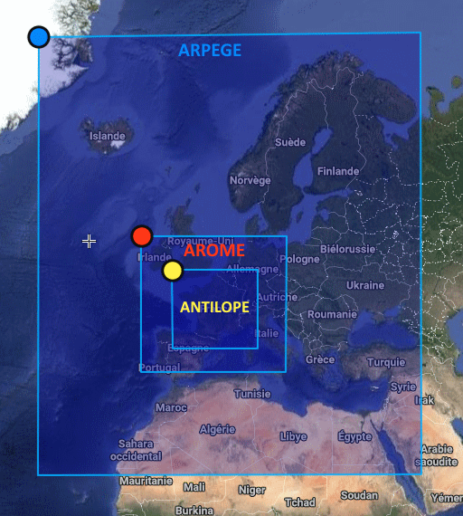

# TITAN : Training Inputs & Targets from Arome for Neural networks

L'objectif est de créer un jeu de données permettant d'entraîner un modèle de PN par IA, à l'échelle de la France métropolitaine, avec les données dont nous disposons aujourd'hui.


## Données

On souhaite disposer du "meilleur état connu" de l'atmosphère à un instant t sur la France Métropolitaine. Pour cela nous avons sélectionné les données suivantes :

* 3 Sources de données : Analyses AROME, ANTILOPE (données de pluie) et Analyses et prévisions ARPEGE (modèle coupleur)
* Pas de temps horaire
* Profondeur : 1 an (au 31/10/2023)
* Format GRIB2




### Paramètres disponibles

- **PAAROME** :
    - Grille EURW1S100 (1.3 km) :
        - Échéance 0h :
            - Niveau 2m : **T, HU**
            - Niveau 10m : **U, V**
            - Niveau SOL : **RESR_NEIGE**
        - Échéance 1h :
            - Niveau 10m : **U_RAF, V_RAF**
            - Niveau SOL : **PRECIP, EAU, NEIGE**
    - Grille EURW1S40 (2.5 km) :
        - Échéance 0h :
            - Niveau mer : **P**
            - Niveau isobares : **Z, T, U, V, VV2, HU, CIWC, CLD_WATER, CLD_RAIN, CLD_SNOW, CLD_GRAUPL**
            - Niveau sol : **COLONNE_VAPO**
        - Échéance 1h :
            - Niveau sol : **FLTHERM, FLSOLAIRE**
- **PA grille EURAT01 (0.1°)**, analyse ou prévision selon disponibilité :
    - Niveau 2m : **T, HU**
    - Niveau 10 : **U, V**
    - Niveau mer : **P**
    - Niveaux isobares : **Z, T, U, V**, **HU**
- **ANTILOPE (ANTJP7CLIM) grille FRANXL1S100** (0.01°), échéance 60min, niveau sol : **Lame d'eau 1h** (cumul pour l'heure suivante)

## Stockage

Le jeu de données est sauvegardé sur Hendrix : `/home/berthomierl/Titan`

* Poids des fichiers GRIB2 pour une heure : ~ 480 Mo

* Poids d'un fichier journalier **compressé** : ~ 6 Go

* Poids du jeu de données **compressé** pour 1 an : ~ 2.2 To


## Contenu d'un fichier

Les données sont regroupées par jour dans des `.tar`. Chaque journée contient 24 `.tar.gz` avec les données correspondant à 1 heure.

Chaque heure contient 14 fichiers GRIB2, regroupant les différents paramètres selon le modèle, la grille, l'échéance (0h ou 1h pour les flux) et le niveau de hauteur.

## Utilisation

### Création du jeu de données

Sur sotrtm35-sidev, toujours commencer par :

```
source /usr/local/sopra/etc/config_taches.soprano-dev  # pour avoir l'utilitaire dap3
source /opt/metwork-mfext-2.1/share/profile  # pour avoir python3
```

Ecrire un fichier `.netrc` avec vos creds pour Hendrix.

Ajoutez le dossier `pnia` au PYTHONPATH :

```
export PYTHONPATH=/home/labia/berthomierl/pnia/pnia/datasets/titan/
```

Lancer :

```
python main.py DATE_DEBUT DATE_FIN
```

### Téléchargement (et conversion en NPY)

Sur priam-sidev :

```runai build```

```runai python dl_and_convert.py DATE_DEBUT DATE_FIN```

Les données seront regroupées dans 1 dossier par heure, contenant chacun 37 fichiers npy.

Chaque fichier npy correspond à un paramètre pour une grille. L'ensemble de ces paramètres est décrit dans `settings.py`.

* Poids d'un dossier pour une heure : ~ 1.3 Go

* Poids d'un dossier pour un jour : ~ 31 Go

* Poids d'un dossier pour un an : ~ 11.4 To


### Test de dataloading

La lecture des GRIBs en python avec xarray et cfgrib est très lente. On peut diviser la vitesse de lecture par 4, en utilisant le module `eccodes-cython`.

Pour se faire, il faut une première fois compiler le module cython (à refaire à chaque modification de la lib eccodes-cython):

```runai exec bash```

```cd ../../libs/eccodes-cython/```

```python setup.py build_ext -i```

Example d'utilisation dans `test_dataloader.py` :

```bash
Read 1 grib PAAROME_1S40_ECH0_ISOBARE.grib, extract 4 params and 2 levels
time fast (eccodes-cython) :  0.7981712818145752
time slow (xarray-cfgrib) :  3.6338307857513428

Chargement de tous les params disponibles, sur 3 niveaux, pour 100 échantillons
--> NPY
67.29507660865784
--> GRIB eccodes-cython
39.533979654312134
--> GRIB xarray-cfgrib
358.0716278553009
```
