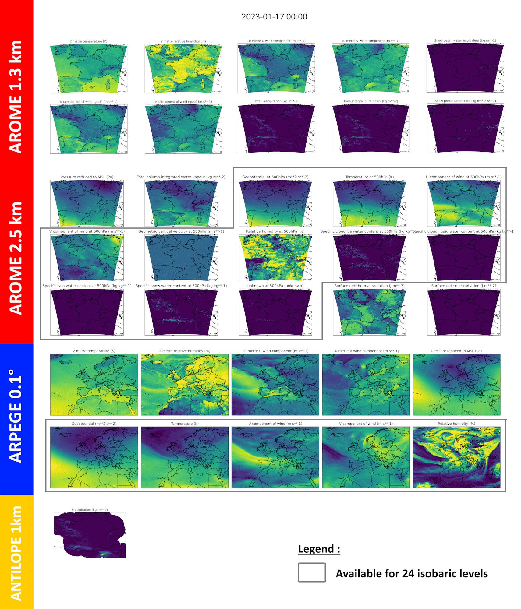

# TITAN : Training Inputs & Targets from Arome for Neural networks

Titan is a dataset made to train an AI NWP emulator on France.

## Data

* 3 data sources: Analyses from AROME, ANTILOPE (rain data calibrated with rain gauges) and analyses and forecasts from ARPEGE (coupling model)
* 1 hour timestep
* Depth: 2 years
* Format GRIB2 (conversion to npy possible)

Download link : [HuggingFace](https://huggingface.co/datasets/meteofrance/titan)

### Available parameters

GRIB2 files are grouped in folders per hour. Each folder contains 14 grib files. Each grib file contains several parameters, grouped per model, grid, leadtime (0h ou 1h for flux) and level.

The parameters in each grib are described here:

| File name  | Model | Grid | Level  | Parameters |
| :---:   | :---: | :---: | :---: | :---: |
| ANTJP7CLIM_1S100_60_SOL | ANTILOPE | FRANXL1S100  (0.01°)  | Ground |  Cumulated Rainfall on next 1h |
| PA_01D_10M | ARPEGE | EURAT01 (0.1°)   | 10m |  U, V |
| PA_01D_2M | ARPEGE  | EURAT01 (0.1°) | 2m |  T, HU |
| PA_01D_ISOBARE | ARPEGE | EURAT01 (0.1°) | 24 Isobaric levels |  Z, T, U, V, HU |
| PA_01D_MER | ARPEGE | EURAT01 (0.1°) | Sea |  P |
| PAAROME_1S100_ECH0_10M | AROME | EURW1S100 (1.3 km) | 10m |  U, V |
| PAAROME_1S100_ECH0_2M | AROME | EURW1S100 (1.3 km) | 2m |  T, HU |
| PAAROME_1S100_ECH0_SOL | AROME | EURW1S100 (1.3 km) | Ground |  RESR_SNOW |
| PAAROME_1S100_ECH1_10M | AROME | EURW1S100 (1.3 km) | 10m |  U_RAF, V_RAF |
| PAAROME_1S100_ECH1_SOL | AROME | EURW1S100 (1.3 km) | Ground |  PRECIP, WATER, SNOW |
| PAAROME_1S40_ECH0_ISOBARE | AROME | EURW1S40 (2.5 km) | 24 Isobaric levels |  Z, T, U, V, VV2, HU, CIWC, CLD_WATER, CLD_RAIN, CLD_SNOW, CLD_GRAUPL |
| PAAROME_1S40_ECH0_MER | AROME | EURW1S40 (2.5 km) | Sea |  P |
| PAAROME_1S40_ECH0_SOL | AROME | EURW1S40 (2.5 km) | Ground |  COLUMN_VAPO |
| PAAROME_1S40_ECH1_SOL | AROME | EURW1S40 (2.5 km) | Ground |  FLTHERM, FLSOLAR |

## Storage

* Size of GRIB2 files for 1 hour : ~ 480 Mo

* Size of **compressed** file for one day : ~ 6 Go

* Size of **compressed** dataset for 1 year : ~ 2.2 To

## Usage

* All interfaces to use the dataset for training are in `__init__.py`

* Use the script `plot_data.py` to plot all the parameters for one time step.

## Notes

* 2024/05/16 : At the moment, the dataloader only works with data from AROME, with one-level parameters. Options for multi-level and multi-grid data will be added later.

* ANTILOPE data are commercial, so they will not be included in the public sample of the dataset.